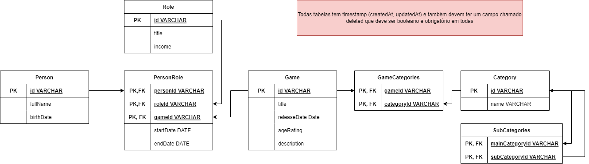

# API Rest #

Creatig an REST API and simple HTML, CSS and JS with Axios to interact with this WebServer.

## Summary ##

- [API Rest](#api-rest)
  - [Summary](#summary)
  - [Running this project](#running-this-project)
    - [Run with live reload](#run-with-live-reload)
  - [MER](#mer)

## Running this project ##

### Run with live reload ###

```bash
npm run dev
```

## MER ##

I want add some new features, and consume some oriented database.


